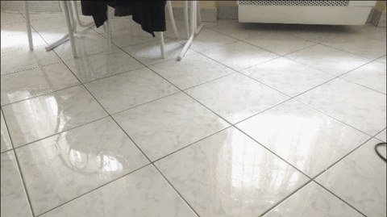

## Multi Object Detecting and Tracking using YOLOv5 

# Multi Object Tracker

Easy to use **multi object tracking** package based on colors :art:

</a> </a>

# 🎯 Object Detection and Alert System using YOLOv5

This project is a real-time object detection and alert system that uses **YOLOv5** to detect and track objects in video or GIF inputs. It supports visual annotations, trajectory lines, and plays an alert sound when specific objects like a **sports ball** or **skateboard** are detected.

---

## 🚩 Problem Statement

Color-based tracking systems (like HSV filtering) are not robust to lighting variations, background noise, or multiple object types. A more reliable, intelligent, and alert-enabled system is required for accurate object detection and tracking.

---

## ✅ Solution

This project solves the above problem using **YOLOv5**, a deep learning-based real-time object detection model, which offers high accuracy and speed. It tracks object movements, displays bounding boxes with class names and confidence scores, and integrates an **audio alert system** for target objects.

---

## 🎯 Key Features

- 🔍 Detects objects using **YOLOv5s or YOLOv5u**.
- 📦 Shows **bounding boxes**, **class labels**, and **confidence scores**.
- 🎥 Works with **GIFs** and **video files** (no need for a webcam).
- 🧠 Plays a **sound alert** when specific objects like sports balls or skateboards appear.
- 📈 Draws **trajectory lines** to indicate object movement.
- 🧩 Easy-to-extend modular design (`yolo_detector.py`, `main.py`).

---

## 🛠️ Tech Stack / Libraries Used

- **Python** – Core programming language
- **YOLOv5** – Deep learning model for object detection
- **OpenCV** – For video processing, bounding boxes, and visualization
- **Pygame** – For playing sound alerts
- **Torch** – Deep learning backend (PyTorch)

---

## 🏗️ Architecture

```text
+-------------------------+
|  Input GIF/Video       |
+-----------+-------------+
            |
            v
+-----------+-------------+
|     YOLOv5 Detector     |  --> Filters detections > 0.5 confidence
+-----------+-------------+
            |
            v
+-------------------------+
|  Annotation & Tracking  |  --> Bounding Boxes + Class + Confidence
|                         |  --> Trajectory Line Visualization
+-----------+-------------+
            |
            v
+-------------------------+
|   Alert System (Sound)  |  --> Triggers on specific classes
+-------------------------+


 
